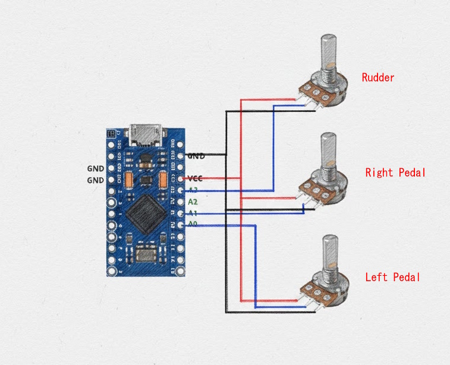

# Cadet Pedals

## Overview

This repository contains the Arduino sketch for the popular 3D-printable [CadetPedals](https://www.thingiverse.com/thing:4655002).

`CadetPedal_V4` converts analog pedal inputs into a USB joystick/gamepad interface. The sketch is designed for flight-simulation setups (HOTAS - Hands On Throttle And Stick) by mapping physical pedal movements to joystick axes.

This version performs startup calibration and automatic wrap detection, removing the need for manual calibration and addressing drift (wrap detection prevents axis rollover when limits are exceeded).

The system reads three analog inputs from the pedals and transmits them as:
- **X-Axis**: Left pedal
- **Y-Axis**: Right pedal
- **Rudder Axis**: Rudder input

## Features

- **Three-Axis Control**: Supports X, Y, and Rudder (twist/roll) axes
- **Automatic Calibration**: Samples pedal positions at startup to determine resting points
- **Dynamic Range Adjustment**: Expands calibration range when pedals exceed initial settings — this ensures the axes never wrap (prevents rollover)
- **Digital Filtering**: 6-point moving-average filter reduces noise from analog inputs
- **USB HID Joystick**: Presents as a standard USB joystick to the host OS

## Hardware Requirements

### Microcontroller
- Arduino Leonardo, Arduino Micro or Pro Micro

### Analog Inputs / Wiring
- A0: X-axis (left) pedal input (0–1023 ADC range)
- A1: Y-axis (right) pedal input (0–1023 ADC range)
- A3: Rudder (R) axis pedal input (0–1023 ADC range)
- GND: Common ground for all potentiometers
- 5V: Potentiometer supply (do not exceed 5V on analog pins)

Recommended potentiometer: 10 kΩ (linear). Wire pot ends to 5V and GND, wiper to the analog pin.



### Wiring tips

You will need 3 wires for ground and Vcc (5v).  To do this take a wire from the arudino to a connection point and then solder 3 wires to that wire.

Do not let the wires flex at the junctions with either the potentiometers or the ardunio, because over a very short period of time they will snap off due to the flexing.  Instead secure the wires to the moving structures straight after the junction (with glue or a zip-tie) so that the flexing is done in the middle of the wires not at the ends.


## Software Requirements

### Arduino IDE Setup
1. Download and install the [Arduino IDE](https://www.arduino.cc/en/software).
2. Install the `Joystick` library (MHeironimus) via Library Manager.
3. Install board support for your board if not already present: `Tools → Board → Boards Manager` → search and install your board package.

### Install Joystick Library (by [MHeironimus](https://github.com/MHeironimus/ArduinoJoystickLibrary))
1. Download https://github.com/MHeironimus/ArduinoJoystickLibrary/archive/master.zip
2. In the Arduino IDE, select Sketch > Include Library > Add .ZIP Library.... Browse to where the downloaded ZIP file is located and click Open. The Joystick library's examples will now appear under File > Examples > Joystick.

## Compilation Instructions

### Using Arduino IDE (Recommended)

1. Open the sketch: `File → Open → CadetPedal_V4.ino`.
2. Select board: `Tools → Board` → choose your ATmega32U4 board (e.g., Arduino Leonardo).
3. Select port: `Tools → Port` → choose the board's COM port.
4. Compile: `Sketch → Verify/Compile` (Ctrl+R).
5. Upload: `Sketch → Upload` (Ctrl+U). The board will reset and present itself as a joystick device.

## Configuration

### Debug Mode (Serial Output)
To enable serial debugging for calibration and raw readings, set:

```cpp
// At the top of the sketch, change:
#define USE_SERIAL 1   // Change to 1 to enable serial debug output
```

When enabled, open the Serial Monitor in the Arduino IDE to see startup calibration values and raw analog readings.

**NOTE: Set this back to 0 after you have finished or you will have problems when not using the IDE's serial monitor**


### Calibration Parameters
The sketch performs automatic startup calibration for resting positions; however, manual calibration may be needed to match each potentiometer's range.

```cpp
// Manual calibration values (use if auto-calibration doesn't work well)
long X_START = 250;      // X-axis zero point
long X_RANGE = 320;      // X-axis range (min to max)

long Y_START = 80;       // Y-axis zero point
long Y_RANGE = 320;      // Y-axis range

long R_CENTER = 500;     // Rudder center point
long R_RANGE = 250;      // Rudder range (±center)
```

## User Instructions for Cadet Pedals

1. Power on
   - Leave the rudder centered and pedals in the zero/up position.
   - Connect the Arduino to your computer via USB.
   - Do not touch the pedals for the first 1 second at startup, as this is used for calibration.

2. Device recognition
   - Windows: Open the Control Panel and go to USB Game Controllers
   - Linux: Use `jstest-gtk` or `evtest`.
   - macOS: Check System Report → USB.

3. Testing in games
   - In your flight simulator (X-Plane, MSFS, DCS, etc.), open Controls/Joystick settings.
   - Calibrate the joystick if required and map pedal axes to the correct flight controls.

### Quick Test
1. Enable serial debug (`#define USE_SERIAL 1`) and upload the sketch.
2. Open Serial Monitor (115200 baud).
3. Move each pedal; confirm you see changing raw values and calibration output.
4. Expected behavior: values move smoothly within the calibrated range; no sudden jumps or wrap-around.

### Troubleshooting

| Issue                             | Solution                                                                                                              |
| --------------------------------- | --------------------------------------------------------------------------------------------------------------------- |
| Device not recognized             | Ensure you are using an ATmega32U4 board (Leonardo/Micro/Pro Micro); check the USB cable and try a different USB port |
| Erratic or jittery values         | Check wiring and grounds; use shielded cables if possible; verify potentiometer wiring and values                     |
| Pedals not responding             | Verify A0, A1, A3 connections and pot wiring; enable serial debug to observe raw readings                             |
| Inverted axis                     | Modify the `map()` calls in the code to swap min/max values                                                           |
| Offset values (not centered)      | Reconnect with all axes in their start positions so auto-calibration can sample correctly                             |
| Device recognized but no movement | Enable serial debugging and inspect readings; ensure pots produce voltage between 0–5V on the wiper                   |

## License

This project is licensed under the MIT License. See the LICENSE file for the full text.

---

**Last Updated**: December 2025  
